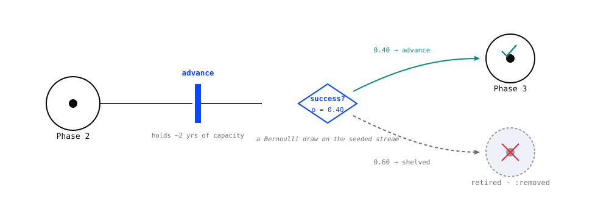

# ReactiveDynamics.jl

A **timed, stochastic, resource-constrained Petri net / discrete-event engine** for system-dynamics-style modeling of business and R&D processes — budgeting, ledgers, what-if analysis, rNPV. Despite the reaction-network DSL surface, it is *not* a chemical reaction network: chemical kinetics is just the archetypal instance of the underlying ontology.

The central concept is a **transition**: a stateful recipe that spawns in-flight instances at a Poisson (or deterministic) rate, occupies shared finite **resources** (species) over a cycle time, and completes with a terminal probability-of-success that emits its products. Resources carry a **modality** governing allocation, a priority-weighted allocator rations them under contention, and a cost/reward/valuation **ledger** accrues into a per-step log. Structured/agentic **tokens** are first-class entities (a "project" carrying its `phase`, `npv`, cost-to-date) that can be instantiated, selected by predicate, advanced through lifecycle phases, and audited per-program. A model is a pure, **eval-free typed data artifact** that round-trips through a single JSON serialization. ReactiveDynamics sits on top of [AlgebraicAgents.jl](https://github.com/Merck/AlgebraicAgents.jl): a `ReactionNetworkProblem` **is** an AA agent, so a network is a node in a larger heterogeneous hierarchy.

```@raw html
<figure class="rd-figure">
  
  <figcaption>A <strong>transition</strong> consumes its inputs and produces its outputs only when it <em>fires</em>. Here it takes a program waiting in Phase&nbsp;2 and — drawing on shared <strong>resource pools</strong> — moves it to Phase&nbsp;3. The program keeps its identity throughout; only its phase changes. Everything else in the engine is elaboration on this picture.</figcaption>
</figure>
```

!!! note "Documentation in progress"
    This site is being built out under the documentation rework (branch `docs-tutorials`). The [introductory tutorial](tutorials/introductory.md) is the first published page and the quality bar for the rest. The full structure — tiered tutorials, applied case studies, and an API reference, with the "why" carried by the normative spec and two companion papers rather than re-hosted here — is chartered in [`spec/DOCS_CHARTER.md`](https://github.com/Merck/ReactiveDynamics.jl/blob/rework/spec/DOCS_CHARTER.md). Until a page lands here, the runnable [`demo/`](https://github.com/Merck/ReactiveDynamics.jl/tree/rework/demo) tours are the source of truth for working code.

## Find your way by intent

- **New here?** Start with the **[introductory tutorial](tutorials/introductory.md)** — author, simulate, and read your first model end to end, closing on a computed, decision-relevant quantity. Then the *advanced* tutorial (structured tokens, resource modalities, in-model decision rules) and the *expert* tutorial (composition, AlgebraicAgents coupling, checkpointing).
- **What can it do for my decision?** The **applied case studies** are decision memos with a headline number: *"What is the marginal eNPV of the Nth scientist?"*, *"What is this in-licensing asset worth to this pipeline?"*, and *"When should you kill a program?"*.
- **How do I call X?** The **API reference**, organized by capability (authoring, structured tokens, rules & actions, construction & simulation, composition, serialization, analysis & visualization, AlgebraicAgents coupling).
- **Why does it behave this way?** The normative [operational-semantics contract](https://github.com/Merck/ReactiveDynamics.jl/blob/rework/spec/CONTRACT_DRAFT.md) (§1–§15) and the [Architecture Decision Records](https://github.com/Merck/ReactiveDynamics.jl/tree/rework/spec/adr) are the source of truth — the modality truth table, the single-clock time model, and the determinism/seeding obligations. Two companion papers argue the *why* in scholarly and executive registers (see [`spec/DOCS_CHARTER.md`](https://github.com/Merck/ReactiveDynamics.jl/blob/rework/spec/DOCS_CHARTER.md) §8).

## How the engine thinks

Two more pictures carry most of the remaining intuition — where the randomness lives, and the two kinds of token the engine holds at once.

```@raw html
<figure class="rd-figure">
  
  <figcaption>When an event fires, the engine draws a success with the transition's <strong>probability</strong>. On success the program <strong>advances</strong>; on failure it is <strong>soft-retired</strong> — flagged <code>:removed</code> but kept on the books, so its history survives for analysis. Multiply these per-phase odds along the chain and you get a program's true probability of ever reaching market: risk-adjustment that <em>emerges from the dynamics</em> rather than being bolted on. Every draw routes through one seeded stream, so a run is reproducible from its seed.</figcaption>
</figure>

<figure class="rd-figure">
  
  <figcaption><strong>Fungible tokens</strong> are pure quantity — cash and headcount, where one unit is indistinguishable from the next. <strong>Structured tokens</strong> are <em>agents</em>: each carries its own attributes and history, so the engine can <code>@select</code> and filter on that state. Holding both in one net — the simplicity of pools where things are interchangeable, the fidelity of individuals where identity matters — is the distinctive move.</figcaption>
</figure>
```

## A first taste

A plain-species SIR epidemic, end to end — the metalanguage, a seeded run, and reading the solution by name:

```julia
using ReactiveDynamics

sir = @reaction_network begin
    α * S * I, S + I --> 2I, name => infection   # a bare numeric rate is a stochastic (Poisson) intensity
    β * I,     I     --> R,  name => recovery
end
@prob_init   sir S = 999 I = 10 R = 0
@prob_params sir α = 0.0001 β = 0.01
@prob_meta   sir tspan = 250 dt = 0.1

prob = ReactionNetworkProblem(sir; seed = 1)   # seed= owns the per-run RNG — the only route to reproducibility
simulate(prob)
prob.sol[!, "I"]                               # read solution columns BY NAME (order is construction order)
```

The [introductory tutorial](tutorials/introductory.md) takes this from here to a computed, decision-relevant quantity.
