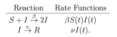
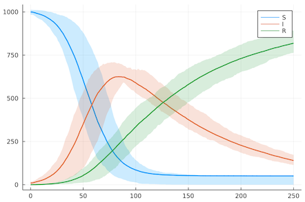
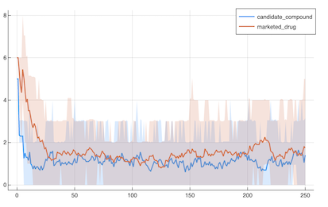
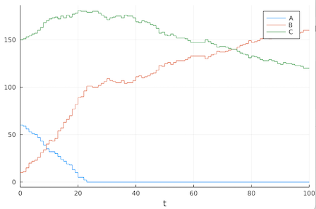
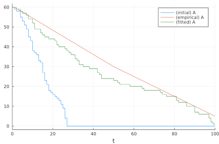

# ReactiveDynamics.jl <br> 

<p align="center">
   <br>
  <a href="#about">About</a> |
  <a href="#context-dynamics-of-value-evolution-dyve">Context</a> |
  <a href="#four-sketches">Four Sketches</a> |
  <a href="https://merck.github.io/ReactiveDynamics.jl/stable">Documentation</a>
</p>

## About

The package provides a category of reaction (transportation) network-type problems formalized on top of the **[generalized algebraic theory](https://ncatlab.org/nlab/show/generalized+algebraic+theory)**, and is compatible with the **[SciML](https://sciml.ai/)** ecosystem.

Our motivation stems from the area of **[system dynamics](https://www.youtube.com/watch?v=o-Yp8A7BPE8)**, which is a mathematical modeling approach to frame, analyze, and optimize complex (nonlinear) dynamical systems, to augment the strategy and policy design.

</a>
<p>The central concept is of a <b>transition</b> (transport, flow, rule, reaction - a subcategory of general algebraic action). Generally, a transition prescribes a stochastic rule which repeatedly transforms the modeled system's <b>resources</b>. An elementary instance of such an ontology is provided by chemical reaction networks.

A <b>reaction network</b> (system modeled) is then a tuple $(T, R)$, where $T$ is a set of the transitions and $R$ is a set of the network's resource classes (aka species). The simultaneous action of transitions on the resources evolves the dynamical system.

The transitions are generally **stateful** (i.e., act over a period of time). Moreover, at each time step a quantum of the a transition's instances is brought into the scope, where the size of the batch is drived by a Poisson counting process. A transition takes the from `rate, a*A + b*B + ... --> c*C + ...`, where `rate` gives the expected batch size per time unit. `A`, `B`, etc., are the resources, and `a`, `b`, etc., are the generalized stoichiometry coefficients. Note that both `rate` and the "coefficients" can in fact be given by a function which depends on the system's instantaneous state (stochastic, in general). In particular, even the structural form of a transition can be stochastic, as will be demonstrated shortly.
</p>

An instance of a stateful transition evolves gradually from its genesis up to the terminal point, where the products on the instance's right hand-side are put into the system. An instance advances proportionally to the quantity of resources allocated. To understand this behavior, we note that the system's resource classes (or occurences of a resource class in a transition) may be assigned a **modality**; a modality governs the interaction between the resource and the transition, as well as the interpretation of the generalized stoichiometry coefficient.

In particular, a resource can be allocated to an instance either for the instance's lifetime or a single time step of the model's evolution (after each time step, the resource may be reallocated based on the global demand). Moreover, the coefficient of a resource on the left hand-side can either be interpreted as a total amount of the resource required or as an amount required per time unit. Similarly, it is possible to declare a resource **conserved**, in which case it is returned into the scope once the instance terminates.

</a>

The transitions are <b>parametric</b>. That is, it is possible to set the period over which an instance of a transition acts in the system (as well as the maximal period of this action), the total number of transition's instances allowed to exist in the system, etc. An annotated transition takes the form `rate, a*A + b*B + ... --> c*C + ..., prm => val, ...`, where the numerical values can be given by a function which depends on the system's state. Internally, the reaction network is stored as a dependency-free typed struct-of-columns (see [ADR 0003](docs/adr/0003-data-store.md)).

For an overview of accepted attributes for both transitions and species classes, read the [docs](https://merck.github.io/ReactiveDynamics.jl/#Update-model-objects)

A network's dynamics is specified using a compact **modeling metalanguage**.

Taking **unions** of reaction networks is fully supported, and it is possible to identify the resource classes as appropriate.

Moreover, it is possible to **export and import** reaction network dynamics using the [TOML](https://toml.io/) format.

Once a network's dynamics is specified, it can be converted to a problem and simulated. The exported problem is a **`DiscreteProblem`** compatible with **[DifferentialEquations.jl](https://diffeq.sciml.ai/stable/)** ecosystem, and hence the latter package's all powerful capabilities are available. For better user experience, we have tailored and exported many of the functionalities within the modeling metalanguage, including ensemble analysis, parameter optimization, parameter inference, etc. Would you guess that **[universal differential equations](https://arxiv.org/abs/2001.04385)** are supported? If even the dynamics is unknown, you may just infer it!

## Context: Dynamics of Value Evolution (DyVE)
 
The package is an integral part of the **Dynamics of Value Evolution (DyVE)** computational framework for learning, designing, integrating, simulating, and optimizing R&D process models, to better inform strategic decisions in science and business.
 
As the framework evolves, multiple functionalities have matured enough to become standalone packages.
 
One such package is **[AlgebraicAgents.jl](https://github.com/Merck/AlgebraicAgents.jl)**, a lightweight package to enable hierarchical, heterogeneous dynamical systems co-integration. It implements a highly scalable, fully customizable interface featuring sums and compositions of dynamical systems. In present context, we note it can be used to co-integrate a reaction network problem with, e.g., a stochastic ordinary differential problem!

## Four Sketches

For comprehensive, self-contained worked examples, see the **[demos](demo)** — [`demo/core_engine_tour`](demo/core_engine_tour) (the metalanguage, resource modalities, the priority allocator, composition, and seeded ensembles) and [`demo/agentic_pipeline`](demo/agentic_pipeline) (structured tokens, in-model decision rules, eval-free JSON models, and checkpointing), alongside the end-to-end [`demo/bd_acquisition`](demo/bd_acquisition) case study.

### SIR Model

The acronym SIR stands for susceptible, infected, and recovered, and as such the SIR model attempts to capture the dynamics of disease spread. We express the SIR dynamics as a reaction network using the compact modeling metalanguage. 

Follow the SIR model's reactions:

<p align="center">
   <br>
</p>

```julia
using ReactiveDynamics

# model dynamics
sir_net = @reaction_network begin
        α*S*I, S+I --> 2I, name=>I2R
        β*I, I --> R, name=>R2S 
end

# simulation parameters
## initial values
@prob_init sir_net S=999 I=10 R=0
## uncertainty in initial values (Gaussian)
@prob_uncertainty sir_net S=10. I=5.
## parameters
@prob_params sir_net α=0.0001 β=0.01
## other arguments passed to the solver
@prob_meta sir_net tspan=250 dt=.1
```

Next we solve the problem.

```
# turn model into a problem
prob = @problematize sir_net

# solve the problem over multiple trajectories
sol = @solve prob trajectories=20

# plot the solution
@plot sol plot_type=summary
## show only species S
@plot sol plot_type=summary show=:S
## plot evolution over (0., 100.) in green (propagates to Plots.jl)
@plot sol plot_type=summary c=:green xlimits=(.0, 100.)
```



### A Primer on Attributed Transitions

Before we move on to more intricate examples demonstrating generative capabilities of the package, let's sketch a toy pharma model with as little as three transitions.

```julia
toy_pharma_model = @reaction_network
```

First, a **"discovery" transition** will take a team of scientist and a portion of a company's budget at the input (say, for experimental resources), and it will **output candidate compounds**.

```julia
@push toy_pharma_model α(candidate_compound, marketed_drug, κ) 3*@conserved(scientist) + @rate(budget) --> candidate_compound name=>discovery probability=>.3 cycletime=>6 priority=>.5
```

Note that per a time unit, `α(candidate_compound, marketed_drug, κ)` "discovery" projects will be started. We provide a name of the class of transitions (`name=>discovery`), set up a probability of the transition terminating successfully (`probability=>.3`), a cycle time (`cycletime=>6`), and we provide a weight of the transitions' class for use in resource allocation (`priority=>.5`).

Moreover, we annotate "scientists" as a conserved resource (no matter how the project terminates, the workforce isn't consumed), i.e., `@conserved(scientist)`, and we state that a unit "budget" is consumed per a time unit, i.e., `@rate(budget)`.

Next, **candidate compounds will undergo clinical trials**. If successful, a compound transforms into a marketed drug, and the company receives a premium. 

```julia
@push toy_pharma_model β(candidate_compound, marketed_drug) candidate_compound + 5*@conserved(scientist) + 2*@rate(budget) --> marketed_drug + 5*budget name=>dx2market probability=>.5+.001*@t() cycletime=>4
```

Note that as time evolves, the probability of technical success increases, i.e., `probability=>.5+.001*@t()`.

In addition, **marketed drugs bring profit to the company** - which will fuel invention of new drugs. 

We model the situation as a periodic callback.

```julia
@periodic toy_pharma_model 1. budget += 11*marketed_drug
```

A **marketed drug may eventually be withdrawn** from the market. To account for such scenario, we add the following transition:

```julia
@push toy_pharma_model  γ*marketed_drug marketed_drug --> ∅ name=>drug_withdrawn
```

Next we provide the functions `α` and `β`.

```julia
@register α(number_candidate_compounds, number_marketed_drugs, κ) = κ + exp(-number_candidate_compounds) + exp(-number_marketed_drugs)
@register β(number_candidate_compounds, number_marketed_drugs) = numbercandidate_compounds + exp(-number_marketed_drugs)
```

Likewise, we set the remaining parameters, initial values, and model metadata:

```julia

# simulation parameters
## initial values
@prob_init toy_pharma_model candidate_compound=5 marketed_drug=6 scientist=20 budget=100
## parameters
@prob_params toy_pharma_model κ=4 γ=.1
## other arguments passed to the solver
@prob_meta toy_pharma_model tspan=250 dt=.1
```

And we problematize the model, solve the problem, and plot the solution:

```julia
prob = @problematize toy_pharma_model
sol = @solve prob trajectories=20
@plot sol plot_type=summary show=[:candidate_compound, :marketed_drug]
```



### Universal Differential Equations: Fitting Unknown Dynamics

We demonstrate how to fit unknown part of dynamics to empirical data.

We use `@register` to define a simple linear function within the scope of module `ReactiveDynamics`; parameters of the function will be then optimized for. Note that `function_to_learn` can be generally replaced with a neural network (Flux chain), etc.

```julia
## some embedded function (neural network, etc.)
@register begin
    function function_to_learn(A, B, C, params)
        [A, B, C]' * params # params: 3-element vector
    end
end
```

Next we set up a simple dynamics and supply initial parameters.

```julia
net = @reaction_network begin
    function_to_learn(A, B, C, params), A --> B+C
    1., B --> C
    2., C --> B
end

# initial values, check params
@prob_init net A=60. B=10. C=150.
@prob_params net params=[.01, .01, .01]
@prob_meta net tspan=100.
```

Let's next see the numerical results for the initial guess.

```julia
sol = @solve net
@plot sol
```



Next we supply empirical data and fit `params`.

```julia
time_points = [1, 50, 100]
data = [60 30 5]

@fit_and_plot net data time_points vars=[A] params α maxeval=200 lower_bounds=0 upper_bounds=.01
```


