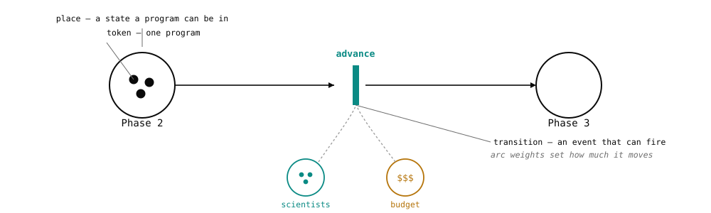
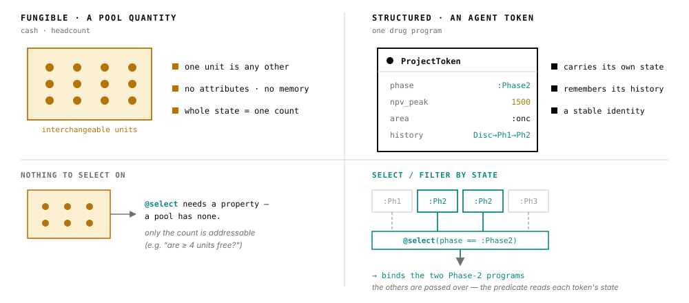

<p align="center">
  
</p>

<p align="center">
  <em>A timed, stochastic, resource-constrained Petri-net engine for modeling business &amp; R&amp;D processes as living systems — budgets, portfolios, what-ifs, rNPV.</em>
</p>

<p align="center">
  <a href="https://merck.github.io/ReactiveDynamics.jl/stable/"></a>
  <a href="https://merck.github.io/ReactiveDynamics.jl/dev/"></a>
  <a href="LICENSE"></a>
  
</p>

<p align="center">
  
</p>

ReactiveDynamics.jl (RD) models a decision as a **living system** — finite people and cash, random outcomes, and levers that fire mid-course — and runs it directly. It is a **timed, stochastic, resource-constrained Petri net / discrete-event engine** for system-dynamics-style modeling of business and R&D processes: budgeting, ledgers, what-if analysis, rNPV. Despite the reaction-network DSL surface, it is *not* a chemical reaction network — chemical kinetics is just the archetypal instance of the underlying ontology.

## Installation

```julia
using Pkg
Pkg.add(url = "https://github.com/Merck/ReactiveDynamics.jl")
```

Requires Julia ≥ 1.12. RD sits on top of [AlgebraicAgents.jl](https://github.com/Merck/AlgebraicAgents.jl), which is installed automatically.

## Quick start

A plain-pool SIR epidemic, end to end — the metalanguage, a seeded run, and reading the solution by name:

```julia
using ReactiveDynamics

sir = @reaction_network begin
    α * S * I, S + I --> 2I, name => infection   # a bare numeric rate is a stochastic (Poisson) intensity
    β * I,     I     --> R,  name => recovery
end
@prob_init   sir S = 999 I = 10 R = 0
@prob_params sir α = 0.0001 β = 0.01
@prob_meta   sir tspan = 250 dt = 0.1

prob = ReactionNetworkProblem(sir; seed = 1)   # seed= owns the per-run RNG — the only route to reproducibility
simulate(prob)
prob.sol[!, "I"]                               # read solution columns BY NAME (order is construction order)
```

The [introductory tutorial](https://merck.github.io/ReactiveDynamics.jl/dev/tutorials/introductory/) takes this from here to a computed, decision-relevant quantity.

## The core idea

The central concept is a **transition**: a stateful recipe that spawns in-flight instances at a Poisson (or deterministic) rate, occupies shared finite **resource pools** over a cycle time, and completes with a terminal probability-of-success that emits its right-hand-side products. A resource pool is a **place**, in Petri-net terms, and the quantity sitting in it is that place's **marking**; the API and the spec use the Petri-net words, this prose uses "resource pool". A transition takes the form `rate, a*A + b*B + … --> c*C + …, prm => val, …`, where `rate` is the expected batch size per time unit and the coefficients are generalized stoichiometry; both may be functions of the system's instantaneous stochastic state. A **reaction network** is a set of transitions acting on shared resource classes, evolved over a single discrete clock.

Two ideas make it expressive enough for real decisions:

- **Resource modalities.** Each consumed resource carries a modality governing how it is claimed against the pool: `@conserved` (held for the instance's lifetime, returned on completion — e.g. scientists), `@rate` (drawn per in-flight tick — e.g. a burn rate), or `@nonblock` (claimed, not held). A priority-weighted progressive-fill allocator rations scarce resources under contention, and a cost/reward/valuation **ledger** accrues into a per-step log.
- **Structured / agentic tokens.** A *token* here is a discrete unit of resource sitting in a place — the Petri-net sense, unrelated to language-model tokens. Beyond scalar pools, a token can be a first-class entity with attributes, a stable identity, and lifecycle history — a "project" carrying its `phase`, `npv`, cost-to-date. Tokens can be instantiated, selected by predicate (`@select`), advanced through phases, and audited per-program. That is the basis for portfolio- and pipeline-style models.

<p align="center">
  
</p>

A model is a pure, **eval-free typed data artifact**: it round-trips through a single JSON serialization with schema validation, so models can be authored, checked, and exchanged as data (host Julia functions are referenced by name through a registry, never embedded as code). Internally the network is a dependency-free typed struct-of-columns (see [ADR 0003](spec/adr/0003-data-store.md)); the engine is the native `ReactionNetworkProblem` type, stepped through [AlgebraicAgents.jl](https://github.com/Merck/AlgebraicAgents.jl) — so a network **is** an AA agent, a node in a larger heterogeneous hierarchy that can be co-integrated with, e.g., an SDE or an agent-based model through declared wires.

## What it's for

The framework earns its keep on decisions a spreadsheet flattens. The [applied case studies](https://merck.github.io/ReactiveDynamics.jl/dev/case_studies/marginal_scientist/) are decision memos, each led by a headline number:

- **[What is the marginal value of the *N*th scientist?](https://merck.github.io/ReactiveDynamics.jl/dev/case_studies/marginal_scientist/)** — the shadow price of the binding resource: on the modeled portfolio, the fifth scientist is worth ≈ **+\$19M** in expected NPV, far more than their salary line.
- **[What is an in-licensing asset worth to *this* pipeline?](https://merck.github.io/ReactiveDynamics.jl/dev/case_studies/inlicensing_value/)** — value is contextual, not a number you look up: the same asset is worth different amounts depending on the contention it lands in.
- **[When should you kill a program?](https://merck.github.io/ReactiveDynamics.jl/dev/case_studies/kill_a_program/)** — an interior optimum in the culling threshold, where freeing contended capacity is worth more than the program you shelve.

## Documentation

Full documentation — tiered tutorials, applied case studies, an API reference organized by capability, and an explanation layer promoting the operational-semantics contract — is published at **[merck.github.io/ReactiveDynamics.jl](https://merck.github.io/ReactiveDynamics.jl/dev/)**.

- **[Tutorials](https://merck.github.io/ReactiveDynamics.jl/dev/tutorials/introductory/)** — *introductory* (author, simulate, and read your first model), *advanced* (structured tokens, modalities, in-model decision rules), and *expert* (composition, AlgebraicAgents coupling, checkpointing).
- **[Case studies](https://merck.github.io/ReactiveDynamics.jl/dev/case_studies/marginal_scientist/)** — the decision memos above, each a runnable, reproducible model.
- **[Reference](https://merck.github.io/ReactiveDynamics.jl/dev/reference/authoring/)** — authoring, structured tokens, rules & actions, construction & simulation, composition, serialization, the JSON model schema, analysis & visualization, and AA coupling.

The normative engineering artifacts live under [`spec/`](spec): [`STATUS.md`](spec/STATUS.md) (state and remaining work — start here), the operational-semantics [`CONTRACT_DRAFT.md`](spec/CONTRACT_DRAFT.md) (§1–§15), and the Architecture Decision Records under [`spec/adr/`](spec/adr).

## Demos

Each [`demo/`](demo) is a self-contained, runnable literate tour with its own README:

- [`core_engine_tour`](demo/core_engine_tour) — the modeling metalanguage, resource modalities, the priority allocator, composition, and seeded ensembles.
- [`agentic_pipeline`](demo/agentic_pipeline) — structured tokens, in-model decision rules, eval-free JSON models, and checkpointing.
- [`introspection_tour`](demo/introspection_tour) — the analysis/observability layer: token trajectories, ensembles, exports, and result plots.
- [`refinement_tour`](demo/refinement_tour) — hierarchical refinement and open-port composition.
- [`aa_integration`](demo/aa_integration) — co-integrating a reaction network with other AlgebraicAgents models.
- [`wires_viz_tour`](demo/wires_viz_tour) — drawing networks, AA wiring diagrams, and exec maps.
- [`bd_acquisition`](demo/bd_acquisition) — an end-to-end business-development acquisition-impact case study (rNPV counterfactual on a living pipeline).

## Context: Dynamics of Value Evolution (DyVE)

RD is part of the **Dynamics of Value Evolution (DyVE)** computational framework for learning, designing, integrating, simulating, and optimizing R&D process models, to better inform strategic decisions in science and business. As the framework matures, functionalities graduate into standalone packages — chief among them [AlgebraicAgents.jl](https://github.com/Merck/AlgebraicAgents.jl), the lightweight substrate for hierarchical, heterogeneous dynamical-systems co-integration on which RD is built.

## Contributing

Contributions to the engine, the documentation, and the worked case studies are welcome — via pull requests, or by reporting bugs and suggesting enhancements in [GitHub Issues](https://github.com/Merck/ReactiveDynamics.jl/issues). See [`CONTRIBUTING.md`](CONTRIBUTING.md) for where to start (the `spec/` design records), the project conventions, and how to run the test suite and formatter.

## License

ReactiveDynamics.jl is released under the [MIT License](LICENSE) © 2023 Merck &amp; Co., Inc., Rahway, NJ, USA and its affiliates. See [`LICENSES_THIRD_PARTY`](LICENSES_THIRD_PARTY) for third-party dependency licenses.
