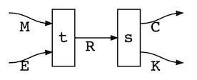
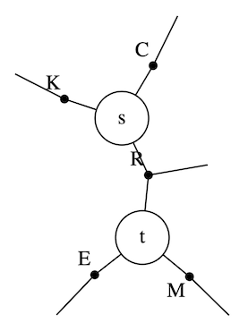
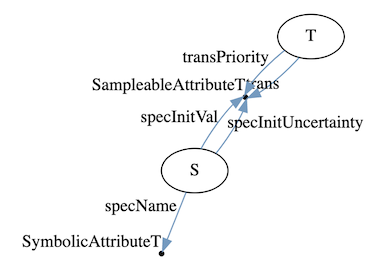

# ReactiveDynamics.jl  

    
  <a href="#about">About</a> |
  <a href="#context-dynamics-of-value-evolution-dyve">Context</a> |
  <a href="#examples--demos">Examples & Demos</a> |
  <a href="#documentation">Documentation</a>

> **Note.** This README is being refreshed alongside the ongoing engine rework (branch `rework`). The framing below reflects the current native discrete-event engine; the polished worked examples, onboarding tutorials, and API reference are being rewritten and are **coming in a follow-up documentation pass** (see [Examples & Demos](#examples--demos) and [Documentation](#documentation)). In the meantime, the runnable [`demo/`](demo) tours are the source of truth for current, working code.

## About

ReactiveDynamics.jl (RD) is a **timed, stochastic, resource-constrained Petri net / discrete-event engine** for system-dynamics-style modeling of business and R&D processes — budgeting, ledgers, what-if analysis, rNPV. Despite the reaction-network DSL surface, it is *not* a chemical reaction network: chemical kinetics is just the archetypal instance of the underlying ontology.

The central concept is a **transition**: a stateful recipe that spawns in-flight instances at a Poisson (or deterministic) rate, occupies shared finite **resources** (species) over a cycle time, and completes with a terminal probability-of-success that emits its right-hand-side products. A **reaction network** is then a set of transitions acting on a set of resource classes; the simultaneous action of the transitions evolves the system over a single discrete clock.

</a>

Transitions are <b>stateful</b> (they act over a cycle time) and <b>parametric</b> — you set the period over which an instance acts, its maximal lifetime, a per-class priority for resource allocation, a probability of successful completion, and so on. A transition takes the form <code>rate, a*A + b*B + ... --> c*C + ..., prm =&gt; val, ...</code>, where <code>rate</code> gives the expected batch size per time unit and the coefficients are generalized stoichiometry. Both the rate and the coefficients may be given by functions of the system's instantaneous (stochastic) state.

Each consumed (left-hand-side) resource carries a **modality** governing how it is claimed against the pool: `@conserved` (held for the instance's lifetime and returned on completion), `@rate` (drawn per in-flight tick), or `@nonblock` (claimed, not held). A priority-weighted progressive-fill allocator rations scarce resources under contention, and a cost/reward/valuation **ledger** accrues into a per-step log.

</a>

Beyond plain scalar resources, RD supports **structured/agentic tokens**: a resource can be a first-class entity with attributes, a stable identity, and lifecycle history (a "project" carrying its `phase`, `npv`, cost-to-date, …). Tokens can be instantiated, selected by predicate, advanced through lifecycle phases, and audited per-program — the basis for portfolio- and pipeline-style models. A model is a pure, **eval-free typed data artifact**: it round-trips through a single JSON serialization with schema validation, so models can be authored, checked, and exchanged as data (host Julia functions are referenced by name through a registry, never embedded as code).

Internally, the reaction network is stored as a dependency-free typed struct-of-columns (see [ADR 0003](spec/adr/0003-data-store.md)); the engine itself is the native `ReactionNetworkProblem` type, stepped through [AlgebraicAgents.jl](https://github.com/Merck/AlgebraicAgents.jl).

## Context: Dynamics of Value Evolution (DyVE)

The package is an integral part of the **Dynamics of Value Evolution (DyVE)** computational framework for learning, designing, integrating, simulating, and optimizing R&D process models, to better inform strategic decisions in science and business.

As the framework evolves, multiple functionalities have matured enough to become standalone packages. One such package is **[AlgebraicAgents.jl](https://github.com/Merck/AlgebraicAgents.jl)**, a lightweight package enabling hierarchical, heterogeneous dynamical-systems co-integration. A `ReactionNetworkProblem` **is** an AlgebraicAgents agent, so a reaction network is a node in a larger heterogeneous AA hierarchy — it can be co-integrated with, e.g., a stochastic differential equation or an agent-based model, reading and writing sibling state through declared wires.

## Examples & Demos

> **Worked README examples are coming in a follow-up documentation pass.** The previous SIR / toy-pharma / universal-differential-equations sketches were written against an earlier (SciML/Catlab) API surface that the rework has replaced, so they have been removed rather than left stale. Refreshed, tested examples will be added here.

For self-contained, runnable examples against the current engine, see the **[demos](demo)** — each is its own literate tour with a README:

- [`demo/core_engine_tour`](demo/core_engine_tour) — the modeling metalanguage, resource modalities, the priority allocator, composition, and seeded ensembles.
- [`demo/agentic_pipeline`](demo/agentic_pipeline) — structured tokens, in-model decision rules, eval-free JSON models, and checkpointing.
- [`demo/introspection_tour`](demo/introspection_tour) — the analysis/observability layer: token trajectories, ensembles, exports, and result plots.
- [`demo/refinement_tour`](demo/refinement_tour) — hierarchical refinement and open-port composition.
- [`demo/aa_integration`](demo/aa_integration) — co-integrating a reaction network with other AlgebraicAgents models.
- [`demo/wires_viz_tour`](demo/wires_viz_tour) — drawing networks, AA wiring diagrams, and exec maps.
- [`demo/bd_acquisition`](demo/bd_acquisition) — an end-to-end business-development acquisition-impact case study (rNPV counterfactual on a living pipeline).

## Documentation

> **API documentation is being rewritten** and will be published to GitHub Pages. The design records and normative specification that document the engine's behavior today live under [`spec/`](spec):
>
> - [`spec/STATUS.md`](spec/STATUS.md) — the single "what is the state, what is left" index. Start here.
> - [`spec/CONTRACT_DRAFT.md`](spec/CONTRACT_DRAFT.md) — the normative operational-semantics specification (§1–§15).
> - [`spec/adr/`](spec/adr) — the Architecture Decision Records (0001–0015).
